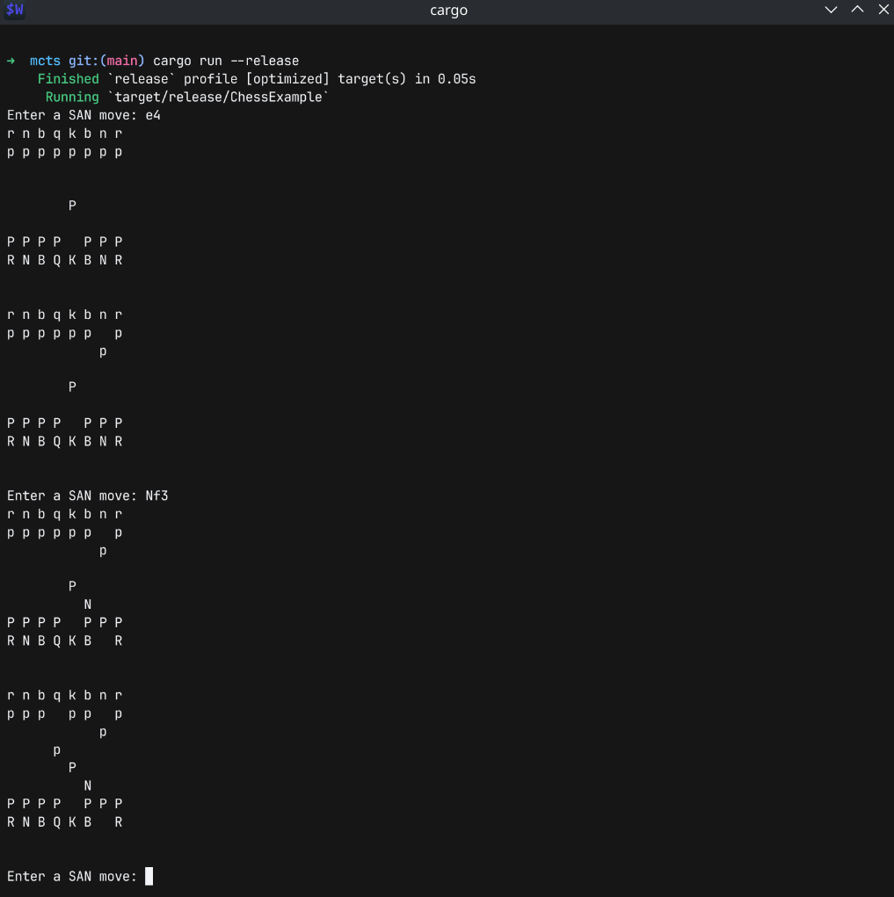
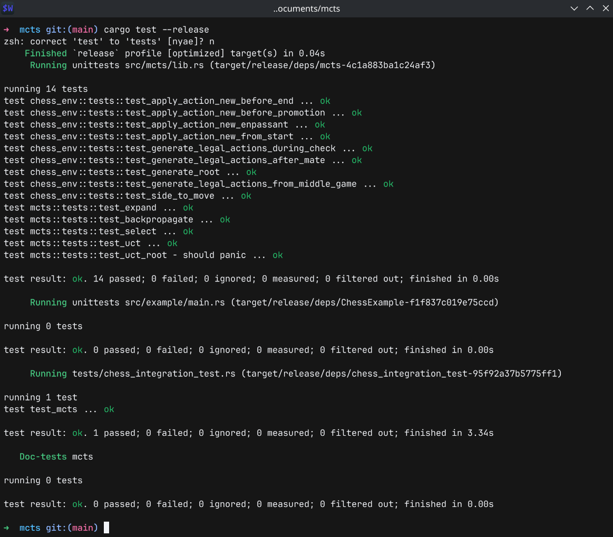

# mcts
Includes a fully-featured highly performant cross-platform MCTS engine library with random rollouts. 
The library can be applied to any game by simply creating a `GameState` trait for a particular game.
Includes an example cross-platform chess `GameState` implementation that can play games and solve puzzles.
Both the engine and the chess example have unit/integration tests. 
Is able to complete over 15k MCTS iterations per second.

# Images 
<table>
  <tr>
    <td valign="top" width="33%">
      
    </td>
    <td valign="top" width="33%">
      
    </td>
  </tr>
</table>

# Features
- Performs over 15 thousand iterations of MCTS per second including selection/expansion/rollout/backpropagation.
- Core MCTS engine is fully game-agnostic with no domain knowledge and random rollouts.
    Implement the included `GameState` trait and the engine will operate on any game.
- Includes an chess implementation of the `GameState` trait with an interactive "play against the engine" mode,
    where the user can type in moves in SAN notation. Prints the board state after every half-ply.
- Includes fully featured unit and integration tests for both the fundemental library and chess implementation.
    Chess integration tests include a set of puzzles to solve.
- Uses arena based memory allocation for nodes. Avoids self-referencial node data structures and explicit pointers.
- MCTS engine uses fast random number generation from xorshift. The chess application uses mialloc for fast memory allocation in the engine.
- Includes fully function MCTS algorithm with selection, expansion, simulation/rollout and backpropagation.
- Selection uses the UCT algorithm to deliver a theoretically perfect balance between explotation and exploration, with
    customizable exploration factor.

# Building/Running
The project is packaged as a single rust library crate, with a chess example packaged as an example binary.

To run the unit and integration tests, as well as the chess puzzle tests, run ```cargo test --relase```.

To play against the MCTS engine, run ```cargo run --release```.
